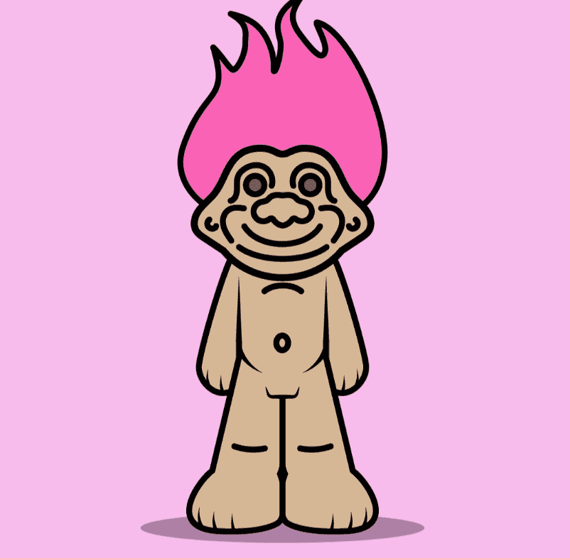

# Degen Kidz

DegenLabzDeployer
对于元宇宙的退化者🌎
Degen Kidz 是存在于以太坊区块链上的 5,555 个随机生成的动画/怀旧 NFT 的集合。 Degen Kidz 持有者享有 NFT 索赔、抽奖、IRL 和 web3 实用程序等独家福利。 欢迎来到实验室🧪

Degen Kidz NFT 在过去 7 天内售出 103 次。Degen Kidz 的总销售额为 1.27 万美元。一份 Degen Kidz NFT 的平均价格为 12.4 美元。有 2,328 名 Degen Kidz 所有者，拥有 5,258 个代币的总供应量。

Degen Kidz NFT - 常见问题（FAQ）
▶ 什么是 Degen Kidz？
Degen Kidz 是一个 NFT（非同质代币）集合。存储在区块链上的数字艺术品集合。
▶ 有多少 Degen Kidz 代币？
总共有 5,258 个 Degen Kidz NFT。目前，2,328 位车主的钱包中至少有一个 Degen Kidz NTF。
▶ Degen Kidz 最昂贵的促销活动是什么？
售出的最昂贵的 Degen Kidz NFT 是 Degen Kidz #5100。它于 2022-06-07（3 个月前）以 3.6k 美元的价格售出。
▶ 最近卖出了多少Degen Kidz？
过去 30 天内共售出 6,714 个 Degen Kidz NFT。
▶ Degen Kidz 的费用是多少？
过去 30 天，Degen Kidz NFT 最便宜的销售额低于 63 美元，最高销售额超过 218 美元。过去 30 天内，Degen Kidz NFT 的中位价格为 157 美元。
▶ 什么是流行的 Degen Kidz 替代品？
许多拥有 Degen Kidz NFT 的用户还拥有 pablos.lol、 troll-town.wtf、 Zimmy Raiders和 GODLY LEGION。

