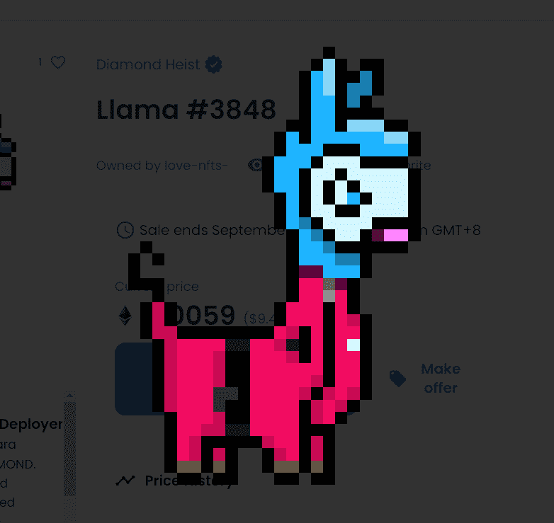

# Diamond Heist

开发商从 3 岁起就开始编码，负责帮助许多社区穿越到 web3 和游戏化。在大流行期间研究以太坊、OHM 分叉、Defi 和 Shiba Inu NFT。Diamond Heist NFT 游戏的英雄创始人。

喵喵叫营销她几乎是为 Metaverse 出生和长大的，在营销、平面设计和项目管理方面拥有十多年的经验，她只喜欢高分辨率图像和 NFT 小报。当她不工作时，您可以在冲浪或滑雪板上找到她，或者以她的方式追求一种太多的爱好。

约旦社区基于 Web3 的加密原生痴迷于去中心化所有事物。这只美洲驼在加密领域拥有 6 年以上的经验，在科技和电子商务领域拥有超过 9 年的经验。现在完全专注于 dApp 和 NFT 开发。

