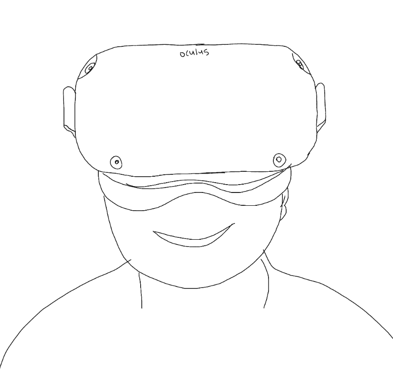

# Diet365

NFT 用于饮食记录。 Diet365 NFT 每天铸造 365 天。 价格每天都会上涨。 第一天 - 1Klay 第二天 - 2Klay 第三天 - 3klay ....... 最后一天 - 365Klay 我写下了我的意志。NFT 用于记录饮食。 每天发行一个 Diet365 NFT。 价格每天都会上涨。 第 1 天 - 1Klay 第 2 天 - 2Klay 第 3 天 - 3klay ....... 最后一天 - 365Klay 我表达了我的意愿。

▶ 什么是 Diet365？
Diet365 是一个 NFT（不可替代令牌）集合。存储在区块链上的数字艺术品集合。
▶ 有多少 Diet365 代币？
总共有 44 个 Diet365 NFT。目前 1 位所有者的钱包中至少有一个 Diet365 NTF。
▶ 最近卖出了多少Diet365？
过去 30 天内售出 0 个 Diet365 NFT。

