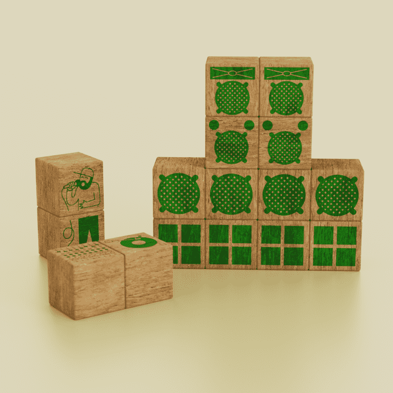

# Digitaldubs Numba 1

2010年，Digitaldubs发行了一张名为“#1”的概念专辑。 这张专辑是限量发行 100 件由木头和丝网印刷制成的艺术品，灵感来自儿童积木游戏，并附有音乐的下载代码。12 年后，我们将其重新编辑为一系列数字 Jah Criss（Digitaldubs 团队的原始成员）的 3D 渲染和 Marcus MPC（Digitaldubs 音响系统的创始人和所有者）的艺术指导和概念。这个系列将展示几个具有不同稀有性和特殊实用程序的 NFT 版本。*这是 Digitaldubs 的独立项目，也是 CryptoRastas 生态系统的一部分

