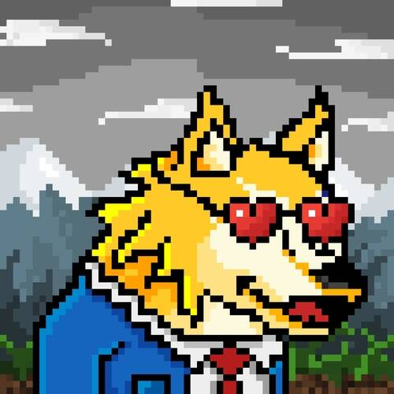

# DireWolves V2

Dire Wolves 是 2,000 个随机生成的 NFT 碎片的集合。我们茁壮成长，为我们的持有者带来实用性和价值。加入队伍，探索仅限会员的活动、狼窝、Dire DAO 以及更多即将到来的活动。

可能性是无法理解的，虽然我们所有的狼都是独一无二的，只有 1/1 的部分，其中一小部分比其他的更特别。谁知道呢，可能有一些狼是领头羊。永远只会存在 2,000 只独特的狼，每只价格,狼窝
狼是基于契约的生物，都属于同一个家；狼窝。

与狼类似，我们的社区建立在狼群居的理念之上：相互支持并能够相互依赖。

主要目标是建立一个强大的社区，重点关注社区丰富和对居住在其中的人的奖励。

从 Dire Wolves 的初始销售中收集到的所有资金的 10% 将分配给 Dire DAO - 资金将用于未来的努力并奖励我们忠诚的包成员。

