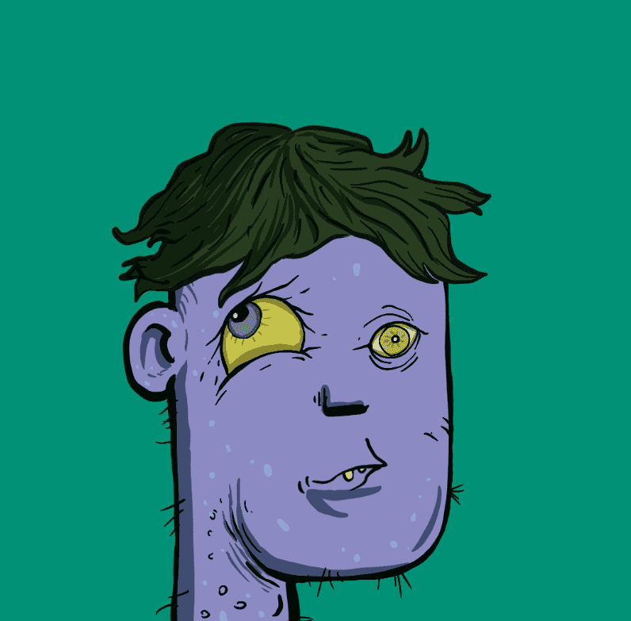

# dirtypunks.wtf official

过去 7 天内没有售出 Dirty Punks。

画朋克🖌

这个项目的灵感不隶属于 Larva Labs，或 CryptoPunks，或 BASTARD GAN PUNKS V1 / V2。

Dirty Punks NFT - 常见问题（FAQ）
▶ 什么是肮脏的朋克？
Dirty Punks 是一个 NFT（非同质代币）集合。存储在区块链上的数字艺术品集合。
▶ 有多少 Dirty Punks 代币？
总共有 403 个 Dirty Punks NFT。目前，87 位所有者的钱包中至少有一个 Dirty Punks NTF。
▶ 最昂贵的 Dirty Punks 销售是什么？
出售的最昂贵的 Dirty Punks NFT 是 Dirty Punk。它于 2022-08-23（10 天前）以 0 美元的价格出售。
▶ 最近卖出了多少 Dirty Punk？
过去 30 天内售出了 2 个 Dirty Punks NFT。

