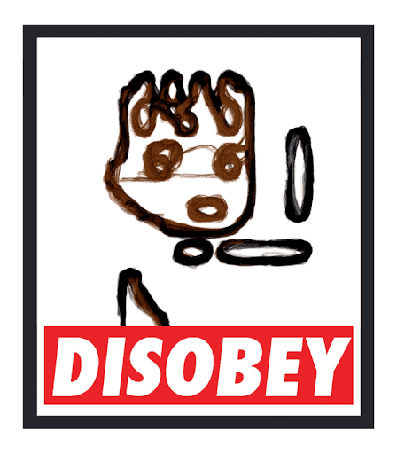

# DISOBEYPUNKS

DISOBEYPUNKS 是 7,000 个独特的手绘波普艺术 NFT 的集合，这些 NFT 生活在 Polygon 区块链上。一个社区驱动的项目，由 CiCK（Punkedups 背后的艺术家，ElonMonst）创作。-DISOBEYPUNKS 有一系列神秘的颜色、特征和最重要的东西，一个朋克灵魂！因为真正的朋克是不服从的；我们想以最艺术的方式与大哥（CryptoPunks）战斗，加入 DISOBEYPUNKS 的军队，帮助我们开始对抗 BIG BROTHER 的革命。——只要分开，我们就无能为力，听话；但是当我们合而为一时，我们是不可战胜的——那些不听话的人。——“因为有一个面包，我们众多的人是一个身体，因为我们所有人都分享一个面包。” (1C, 10:17)- 使用 Rarityranks 检查您的稀有度/等级：我们刚刚在 TufoNFT 上获得了我们的第一个蓝筹股：-

