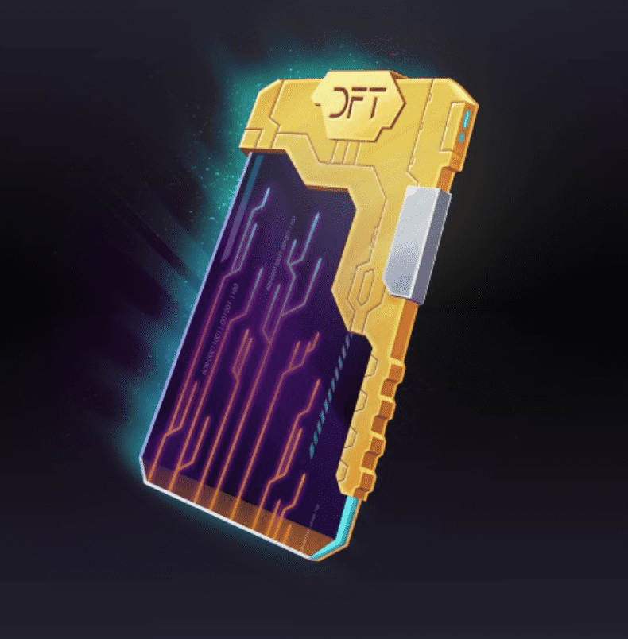

# Dissolution

《Dissolution》是一个由玩家驱动的鲜活、会呼吸的科幻宇宙。 创建公司、收集资源、交易和控制领土，同时赚取以太坊区块链支持的战利品。 目前处于抢先体验阶段。

免责声明
如果您是来体验一款干净、精致的 AAA 级游戏，那么这款游戏（在当前状态下）不适合您。如果您有兴趣与专门的开发团队一起参与游戏，查看进度并帮助指导游戏的开发，那么您来对地方了！当前项目处于 ALPHA 中，并不代表最终的质量产品。在您的帮助和耐心的帮助下，我们目前正在测试错误、故障和多人游戏性能。在游戏期间，您会遇到错误、崩溃和未完成的功能。请向我们的 Steam 错误报告线程或我们的 Discord 报告错误。我们将尝试尽快推出更新。加入我们的 DISCORD 社区，帮助报告错误和请求功能。
背景故事
在 Dissolution 的世界中，地球已被大规模杀伤性武器摧毁，他们拼命试图阻止接管地球大部分地区的 AI 进展。虽然大多数人类在导弹落下之前无法逃离地球，但一小部分人类已经扩散到太阳系的大部分地区，少数幸存者一直试图将人类团结在一起。游戏发生在地球上最后一场战争之后近三个世纪。 AI生产设施在核火中全部被摧毁，但他们的一些部队幸存下来，躲藏在太阳系的黑暗边缘。然而，生存并不容易。食物总是供不应求，过滤和收集水需要宝贵的能源。剩下的军队联合起来组建了星际防御部队（IPDF）。他们的任务主要是作为维和人员解决争端，保护定居者免受盗窃物资的土匪的侵害。面对饥荒、谋杀和剩余人工智能力量的持续威胁，使人成为人类的东西正在迅速消失。
游戏玩法
Dissolution 在游戏中既有 FPS 又有太空载具。我们的目标是在游戏内经济和战斗中实现身临其境且激烈的游戏玩法。解散是一个活生生的游戏，这意味着你在游戏中采取的每一个动作都会产生真正的后果。像采矿和销售矿石这样简单的事情会在世界上产生蝴蝶效应：矿石价格会下降，工厂的运营成本会降低，最终甚至商品价格也会下降。

同时，如果你像海盗一样攻击一条贸易路线，切断同一种矿石的供应路线，则会产生相反的效果。
我们将允许玩家在玩游戏时有很大的自由和个人选择。您将能够购买房产、车辆、武器、交易股票和债券，并参与价格由供需决定的自由浮动经济。你可能是一个和平主义者，甚至没有枪支，或者成为一个无情的海盗，掠夺补给船，没有幸存者。市场将允许玩家之间进行自由交易。
发展
我们的团队由四位非常敬业的游戏开发人员组成，他们希望创建不同的太空 MMO 游戏。我们目前进行了大约一年半的开发，并计划在 2022 年之前发布 1.0 版。希望更深入了解我们里程碑的人们可以在这里找到我们的 Trello 页面。目前，公众可以使用抢先体验 Alpha 版，以帮助我们测试和接收有关游戏设计的反馈。

