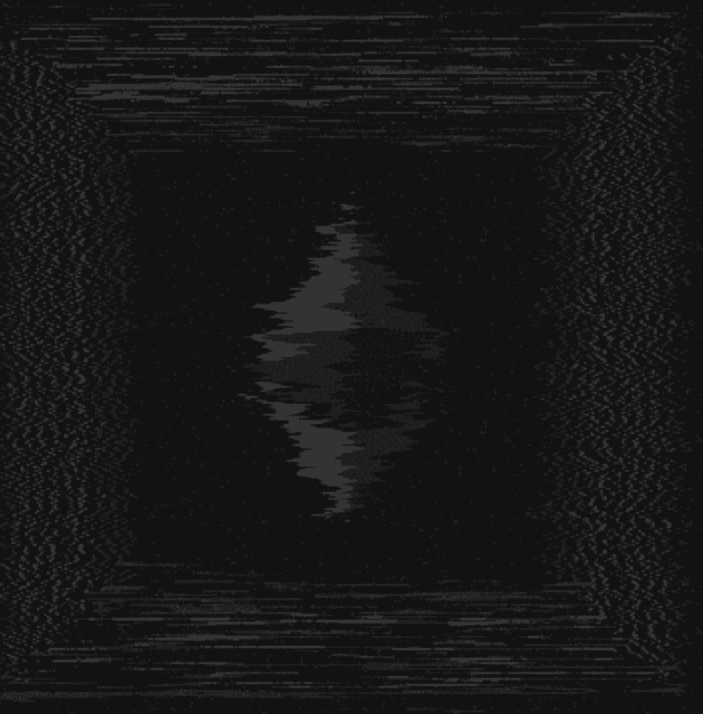

# Distortion Genesis

Distortion 是一个完全手工输入的 100% 链上艺术收藏。 它被设计为在没有外部浏览器库（例如 p5js）的情况下显示。Distortion 的骨架被包装在一个智能合约中，该合约将使用原始集合的最终铸币块的哈希作为输入，以确保该集合具有不可变和 可验证的出处。这是目前唯一的官方收藏，最大供应总量为 1,111 件。Discord：https://discord.gg/r6s4k3pdHQ

Distortion Genesis NFT - 常见问题（FAQ）
▶ 什么是畸变创世纪？
Distortion Genesis 是一个 NFT（不可替代代币）集合。存储在区块链上的数字艺术品集合。
▶ Distortion Genesis 代币有多少？
总共有 1,111 个 Distortion Genesis NFT。目前，569 位所有者的钱包中至少有一个 Distortion Genesis NTF。
▶ 最近卖出了多少扭曲创世纪？
过去 30 天内售出了 24 个 Distortion Genesis NFT。
▶ Distortion Genesis 的价格是多少？
在过去 30 天里，最便宜的 Distortion Genesis NFT 销售额低于 12 美元，最高销售额超过 38 美元。过去 30 天内，Distortion Genesis NFT 的中位价格为 21 美元。
▶ 什么是流行的 Distortion Genesis 替代品？
许多拥有 Distortion Genesis NFT 的用户还拥有 音乐、爱情、死亡：第一章、 熟悉的记忆：第二章、 DegenOkayBears和 EL NUMEROS。

