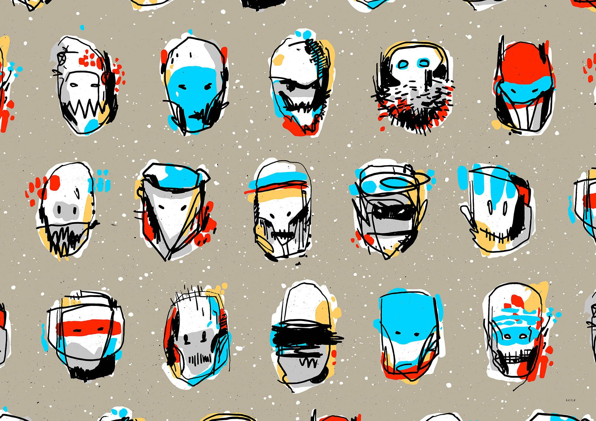

# Distracted Identity BlockParty

分心的身份 BlockParty 统计数据
创建于 8 个月前
17 代币供应
10% 费用
在过去 7 天内没有出售 Distracted Identity BlockParty。

杰里米·奥斯汀（Jeremy Austin）的分心身份是 15 个顽皮的角色在 Blockparty 上松散，你的角色正在和几个朋友闲逛，你的下落取决于你到达派对的时间。一旦派对满员（收集了所有积木），将创建复合艺术品，并相应更新各个积木以显示您与谁一起闲逛，每个积木内将显示其他角色的提示以显示谁挂在两边，上面和下面。

空投：1/15 版名为“分心身份 BLOCKPARTY”的复合艺术品空投给每个分心身份持有者。
自定义命名：您将有机会将自定义名称附加到您的分心身份。
令牌刷新：分心的身份将通过动画和罗德斯先生专门为 BlockParty 制作的曲目进行更新。

