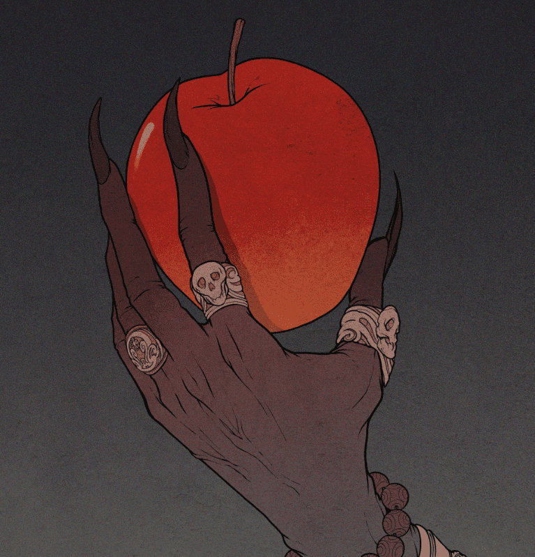

# Divine Apples

Divine Apples NFT 在过去 7 天内售出 6 次。Divine Apples 的总销售额为 391.26 美元。一个 Divine Apples NFT 的平均价格为 65.2 美元。有 1,236 名 Divine Apples 所有者，拥有总供应量 2,999 个代币。

伊甸园的苹果

3次投票结束时，将随机空投500个升天苹果和500个坏苹果到参与投票者的钱包中。获胜派系的人将获得提升苹果。败者将获得坏苹果。

提升苹果让公民有机会提升，确保他们在神圣法庭结束时生存。

坏苹果让公民有机会向造物主牺牲自己以换取 1 个升天苹果，该苹果可以被另一个公民用于升天。

Divine Apples NFT - 常见问题（FAQ）
▶ 什么是神苹果？
Divine Apples 是一个 NFT（不可替代令牌）集合。存储在区块链上的数字艺术品集合。
▶ 有多少神圣苹果代币？
总共有 2,999 个 Divine Apples NFT。目前，1,236 位所有者的钱包中至少有一个 Divine Apples NTF。
▶ 什么是最昂贵的神圣苹果销售？
最昂贵的 Divine Apples NFT 是 Ascension Apple。它于 2022-06-06（3 个月前）以 136 美元的价格售出。

