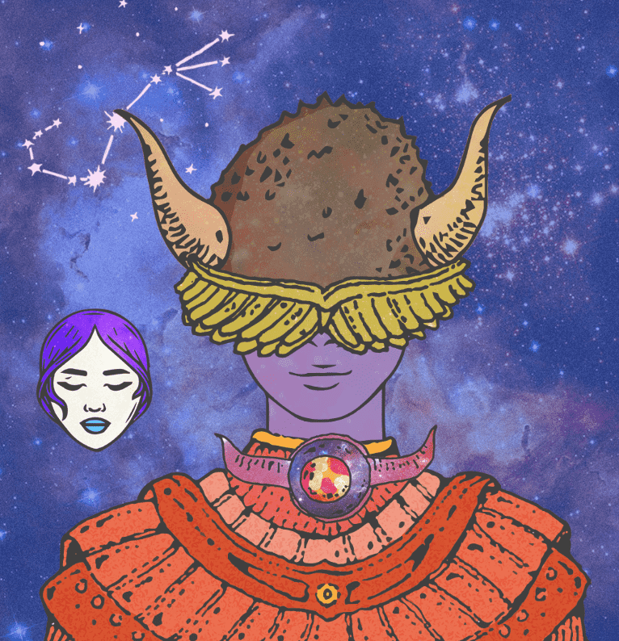

# The Divine Order Of the Zodiac

过去 7 天，十二生肖 NFT 共售出 27 次。《十二生肖神令》的总销量为 232.7 美元。一份生肖 NFT 的平均价格为 8.6 美元。黄道十二宫拥有者共有 3,537 名，总供应量为 9,999 个。

The Divine Order of the Zodiac 是一组手绘 NFT，庆祝十二生肖、主宰行星和元素精神。

十二生肖神序 NFT - 常见问题（FAQ）
▶ 什么是十二生肖的神序？
The Divine Order Of The Zodiac 是一个 NFT（Non-fungible token）集合。存储在区块链上的数字艺术品集合。
▶ 十二生肖神令令牌有多少个？
总共有 9,999 个生肖 NFT 的神圣顺序。目前，3,537 位拥有者的钱包中至少有一本生肖 NTF 的神圣命令。
▶ 最贵的十二生肖拍卖会是什么？
售出的最贵的生肖 神令 NFT 是生肖神令 #8481。它于 2022-08-18（15 天前）以 28.1 美元的价格售出。
▶ 十二生肖神令最近卖出了多少？
过去 30 天共售出 58 个生肖 NFT 的神圣秩序。
▶ 十二生肖神令要多少钱？
过去 30 天，最便宜的生肖 NFT 销售额低于 0 美元，最高销售额超过 14 美元。过去 30 天，十二生肖 NFT 的中位数价格为 9 美元。
▶ 什么是流行的十二生肖替代品？
许多拥有 The Divine Order Of the Zodiac NFT 的用户还拥有 Wicked Craniums Comic、 Avatar Project Redirect、 Chromospheres和 Spunks。

