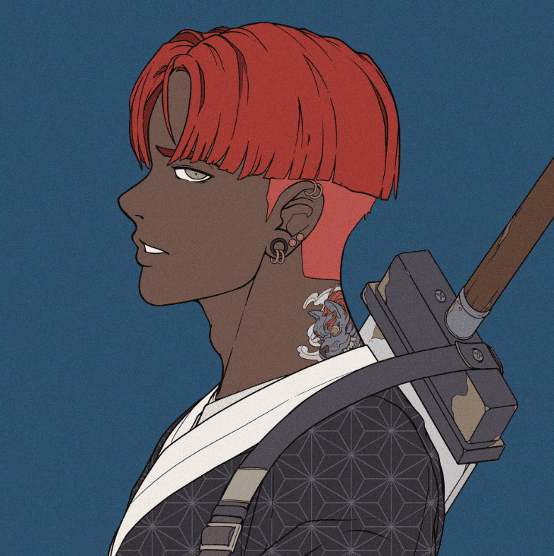

# Divine Anarchy

官方神圣无政府状态收藏。 10,011 个无政府状态的孩子。世界上第一个 NFT 社交角色扮演游戏。神圣无政府状态是 10,011 个独特的动漫主题数字收藏品，生活在以太坊区块链上。 您的无政府之子兼任您的可玩角色，并在神圣无政府的官方世界中授予会员专属福利的特殊访问权限。 在一个混乱的世界里，有两个派系，英雄和复仇女神。 在这些派系中，有来自亚特兰蒂斯人、蒙古人、创世纪等的各种独特角色，一旦熟悉我们的世界就会出现。 会员可以通过我们的 DA 第 2 季 anarchyLatest 收藏路线图查看未来收藏的特别早期访问权限：https://opensea.io/collection/da-wasteland

大洪水

正如故事所说，由于人类的傲慢，造物主向世界投下了洪水。地区被摧毁。社会流离失所。发誓再也不会让人类遭受这样的命运，十位虚灵君主被选中代替他进行审判。造物主认为世界的命运应该掌握在居住者的手中，以虚灵君主为首，形成了神庭。

大洪水已经六千年了。由于人类的堕落，Ethereal Monarchs再次行使了他们对人类作出判断的与生俱来的权利。

无论人类的意图是好的、邪恶的还是冷漠的，每个被选中参加神圣法庭的人都是变革的推动者。

