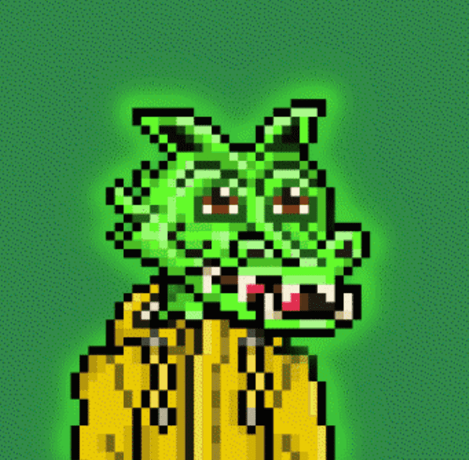

# Dizzy Dragons

Dizzy Dragons 是一个最初由 7,500 个像素艺术 NFT 组成的集合，这些 NFT 存在于以太坊区块链上。 融合窗口已关闭在有限的时间内，您可以融合两条晕龙，自定义您的 NFT，并减少龙的数量，以及将永远存在的特征。编号 7501 的晕龙已经融合

Dizzy Dragons NFT 在过去 7 天内售出 8 次。Dizzy Dragons 的总销售额为 391.91 美元。一份 Dizzy Dragons NFT 的平均价格为 49 美元。有 2,099 名 Dizzy Dragons 所有者，总共拥有 5,593 个代币。

Dizzy Dragons NFT - 常见问题（FAQ）
▶ 什么是眩晕龙？
Dizzy Dragons 是一个 NFT（非同质代币）集合。存储在区块链上的数字艺术品集合。
▶ 有多少 Dizzy Dragons 代币？
总共有 5,593 个 Dizzy Dragons NFT。目前，2,099 位车主的钱包中至少有一个 Dizzy Dragons NTF。
▶ Dizzy Dragons 最昂贵的促销活动是什么？
最昂贵的 Dizzy Dragons NFT 是 Dizzy Dragon #8894。它于 2022-08-17（16 天前）以 109.3 美元的价格售出。
▶ 最近卖出了多少头晕龙？
过去 30 天内共售出 33 个 Dizzy Dragons NFT。
▶ Dizzy Dragons 的价格是多少？
过去 30 天，最便宜的 Dizzy Dragons NFT 销售额低于 14 美元，最高销售额超过 75 美元。过去 30 天内，Dizzy Dragons NFT 的中位价格为 28 美元。
▶ 什么是流行的 Dizzy Dragons 替代品？
许多拥有 Dizzy Dragons NFT 的用户还拥有 Dizzy Demons、 RUG.WTF、 Eyes On Who和 365days DRAWING CHALLENGE。

