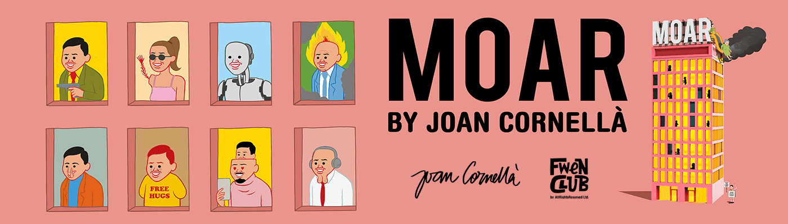

# MOAR by Joan Cornella

这是一个名为“MOAR”的虚拟世界中的豪宅的故事。这是一座建筑，其中 5,555 个生物及其灵魂使用 ERC721 区块链作为 NFT 铸造而成。虽然世界因外星人的入侵而处于封锁状态，但住在 MOAR 的客人，包括人类、僵尸和半机械人，都和平地生活在一起。每一个都是独一无二的，由西班牙艺术家 Joan Cornellà 使用 180 多个独特属性手绘而成。
MOAR 是一座相当不寻常的豪宅，您可以在这里找到商店、游戏和虚拟展览。让我们一起见证最伟大的艺术和元宇宙体验之一。

奇 MOAR#1 的拍卖已经结束。谢谢！
这个拿着枪的西装男子通常出现在艺术家的著名作品中，这无疑使其成为 5,555 NFT 收藏中最有价值和最受欢迎的 pfp。
本次拍卖的获胜者将获得空投的第二阶段相同传奇 3D 头像的令牌以及彩绘画布（H273 x W220mm）。
所有收益将用于“MOAR”未来的 DAO 开发。

