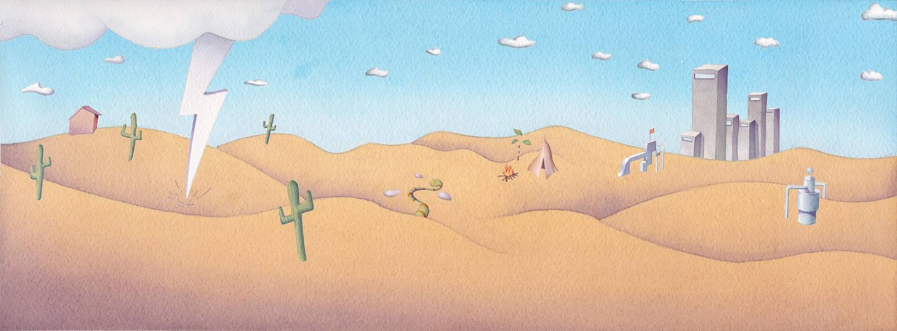

# DLG.

DLG。统计数据
创建于 5 个月前
77代币供应
10% 费用
没有 DLG。在过去 7 天内售出。

由 DLG 创建。关于声音。在对这首歌发表评论,DLG。NFT - 常见问题（FAQ）
▶ 什么是 DLG。？
DLG。是一个 NFT（不可替代代币）集合。存储在区块链上的数字艺术品集合。
▶ 多少 DLG。代币存在吗？
总共有 77 个 DLG。NFT。目前有 47 位业主拥有至少一个 DLG。NTF 在他们的钱包里。
▶ 多少 DLG。最近有卖吗？
有 0 个 DLG。过去 30 天内售出的 NFT。
▶ 什么是流行的 DLG。备择方案？
许多拥有 DLG 的用户。NFT 还在 Sound xyz 上拥有花粉， 在 Sound.xyz 上拥有slenderbodies、 Grady和 Clear eyes。

