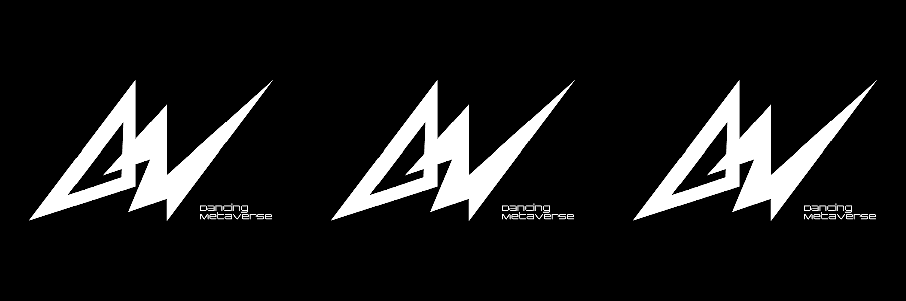

# Dancing Metaverse Sound

跳舞 Metaverse Sound NFT - 常见问题（FAQ）
▶ 什么是 Dancing Metaverse Sound？
Dancing Metaverse Sound 是一个 NFT（Non-fungible token）集合。存储在区块链上的数字艺术品集合。
▶ 有多少 Dancing Metaverse Sound 代币？
总共有 10 个 Dancing Metaverse Sound NFT。目前 6 位所有者的钱包中至少有一个 Dancing Metaverse Sound NTF。
▶ 最近卖出了多少 Dancing Metaverse Sound？
过去 30 天内共售出 0 个 Dancing Metaverse Sound NFT。跳舞元界声音统计
创建于 4 个月前
10 代币供应
0% 费用
过去 7 天没有售出 Dancing Metaverse Sound。

我们正在为 web3 时代制作新音乐,

