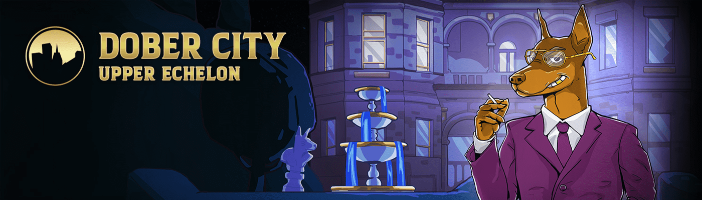

# Dober City : The Upper Echelon

多伯城：上层梯队统计
创建于 10 个月前
504代币供应
2.5% 费用
过去 7 天没有 Dober City : The Upper Echelon 已售出。▶ 什么是杜伯市：上层梯队？
Dober City : The Upper Echelon 是一个 NFT（非同质代币）集合。存储在区块链上的数字艺术品集合。
▶ Dober City : Upper Echelon 代币有多少？
总共有 504 个 Dober City : The Upper Echelon NFT。目前，219 位车主的钱包中至少有一个 Dober City : The Upper Echelon NTF。
▶ Dober City : The Upper Echelon 最近卖出了多少？
过去 30 天内售出 0 个 Dober City : Upper Echelon NFT。

