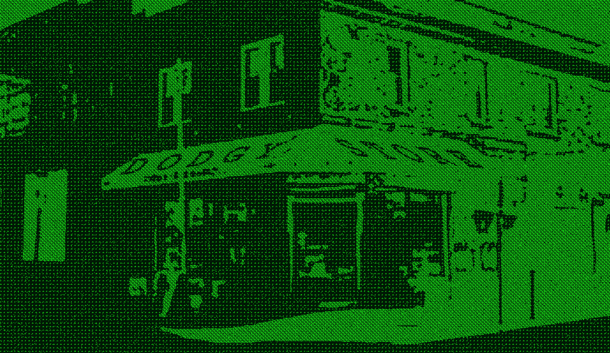

# DODGY STORE

狡猾的钱币持有人可以要求 1/1在[这里](https://www.nft-stats.com/collection/opensea.io/collection/flee-blood)找到的件 如果没有声称它们将在每周结束时以清仓销售的价格出售每件狡猾的钱将以 20 美元的价格出售，有时可通过其他方法获得

DODGY STORE NFT - 常见问题（FAQ）
▶ 什么是 DODGY STORE？
DODGY STORE 是一个 NFT（非同质代币）集合。存储在区块链上的数字艺术品集合。
▶ 存在多少 DODGY STORE 代币？
总共有 14 个 DODGY STORE NFT。目前，11 位所有者的钱包中至少有一个 DODGY STORE NTF。
▶ 最近卖出了多少 DODGY STORE？
过去 30 天内售出 0 个 DODGY STORE NFT。
▶ 流行的 DODGY STORE 替代品有哪些？
许多拥有 DODGY STORE NFT 的用户还拥有 FLEE_BLOOD、 GLITCHSAFARI、 All Around Me和 Wandering Zimmy Raiders。

