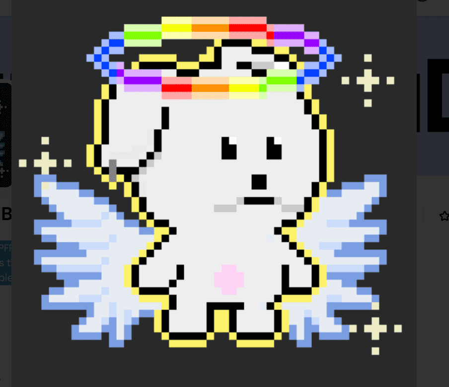

# Dog Gone Bad

有一天，小人绑架了主人？！ H本来是一只好狗，当主人在他面前被绑架时，他开始寻找主人！ 但是这个世界太难了。 坏小狗能阻止恶棍 Taco 使用狗狗零食来拯救他们的主人吗？

Dog Gone Bad 是一个基于 Klaytn 的 PFP 项目。 和可爱的小狗一起，你可以学习如何发行多种用途的 NFT，包括 Reveal、Reinforcement、Game System 和 Defy，并通过多个项目共同成长。

Dog Gone Bad 是一个 PFP 项目，旨在创建一个充满爱与关怀的社区。 它探索了连通性的概念，并计划弥合多个区块链环境之间的差距。

