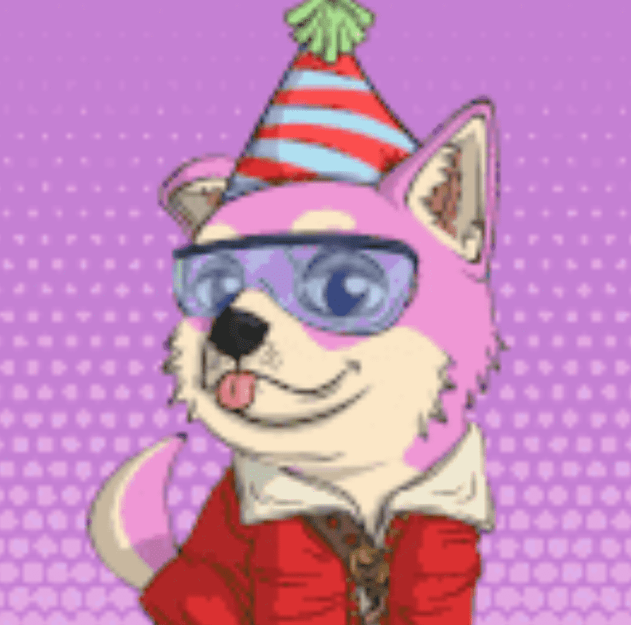

# Doge Pound Puppies

来自 The Doge Pound 的创造者来自 Doge Pound Puppies。 他们很可爱，很可爱，也准备登月了！ 收集自己一个成年人和一只小狗，在路上你可能会解锁一些特别的东西！

行星行星狗狗磅小狗
Doge Pound Puppies 收藏了 10,000 件艺术品，仅适用于 Doge Pound 持有者。 每个 OG Doge 持有者都可以铸造具有随机分配特征的小狗。 比例为 1:1，这意味着您可以铸造尽可能多的小狗，就像您拥有 OG Doges 一样。 打开一个板条箱，发现你的小狗。

狗狗收容所
我们与乞力马扎罗动物救援 (KAR) 合作，在坦桑尼亚建造了一个狗救援收容所。 KAR 救助严重营养不良、严重受伤或患有疥癣和其他寄生虫感染的流浪流浪狗。

施工工作于 2021 年 9 月开始，狗狗们很快就会搬进新家。 救援避难所被称为 Doge Pound Shelter。 坦桑尼亚数以百万计的流浪狗生活在严重的痛苦和危险之中，我们的收容所将为数百只需要帮助的狗提供一个充满爱的家。

