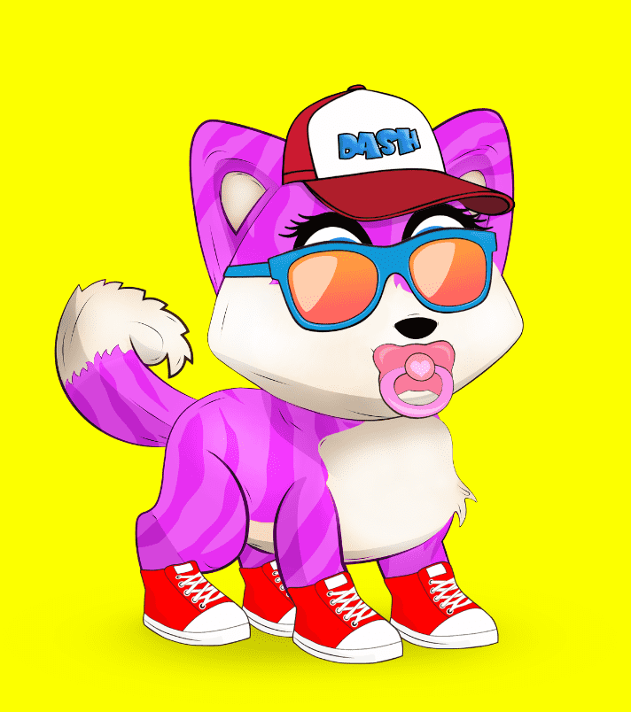

# dogedash

Doge Dash NFTS 是可爱、有趣的艺术品，每件都具有独特的个性和风格。 持有者只需将其放在钱包中，就可以在 Doge Dash Play-To-Earn 游戏中扮演他们的 NFT。 少数幸运儿还将获得特殊能力，例如额外生命、超级跳跃，甚至双倍奖励。

dogedash NFT 在过去 7 天内售出 14 次。dogedash 的总销售额为 3.04 万美元。一个 dogedash NFT 的平均价格为 217 美元。有 1,520 名 dogedash 所有者，总共拥有 4,120 个代币。

dogedash NFT - 常见问题（FAQ）
▶ 什么是dogedash？
dogedash 是一个 NFT（不可替代代币）集合。存储在区块链上的数字艺术品集合。
▶ 存在多少个 dogedash 代币？
总共有 4,120 个 dogedash NFT。目前，1,520 名所有者的钱包中至少有一个 dogedash NTF。
▶ 最昂贵的 dogedash 销售是什么？
售出的最昂贵的 dogedash NFT 是 #1734。它于 2022-07-02（2 个月前）以 1.6k 美元的价格售出。
▶ 最近卖了多少dogedash？
过去 30 天内售出了 31 个 dogedash NFT。
▶ Dogedash 的价格是多少？
在过去 30 天里，最便宜的 dogedash NFT 销售额低于 46 美元，最高销售额超过 287 美元。在过去 30 天内，dogedash NFT 的中位价格为 60 美元。
▶ 什么是流行的 dogedash 替代品？
许多拥有 dogedash NFT 的用户还拥有 Injective SuperFarm Genesis、 BAYC-Bored Ape Collection、 Royal Ceramic Club和 888 Inner Circle-Red Realm。

