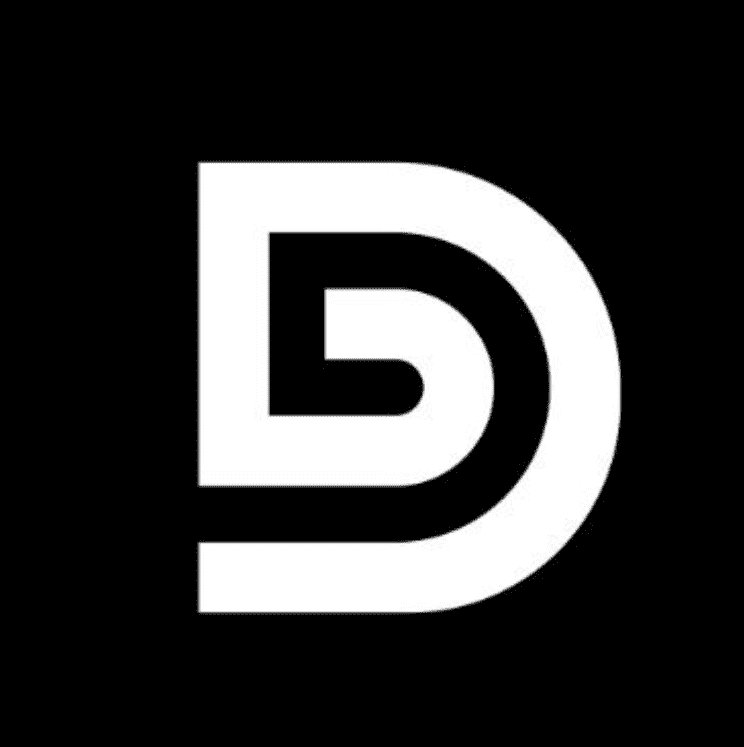

# Doggo Bricke

过去 7 天内没有售出 Doggo Bricke。

#Presale Live # OpenSea™认证官方账户 #NFT网站| 不和谐| Instagram | 推特NFT

DoggoBrick 是一个以社区为重点的衍生 NFT 集合，包含 9,999 个稀有 Nft。 每个 NFT 都是使用 140 多种属性（如帽子、眼睛、皮肤等等）的组合通过算法生成的！ DoggoBrick 在以太坊 (ETH) 区块链上推出，旨在以可承受的价格提供高质量的艺术品，同时执行广泛的路线图。

Doggo Bricke NFT - 常见问题（FAQ）
▶ 什么是狗狗砖？
Doggo Bricke 是一个 NFT（非同质代币）集合。存储在区块链上的数字艺术品集合。
▶ 存在多少 Doggo Bricke 代币？
总共有 100 个 Doggo Bricke NFT。目前 2 位所有者的钱包中至少有一个 Doggo Bricke NTF。
▶ 最近卖了多少狗狗砖？
过去 30 天内售出 0 个 Doggo Bricke NFT。

