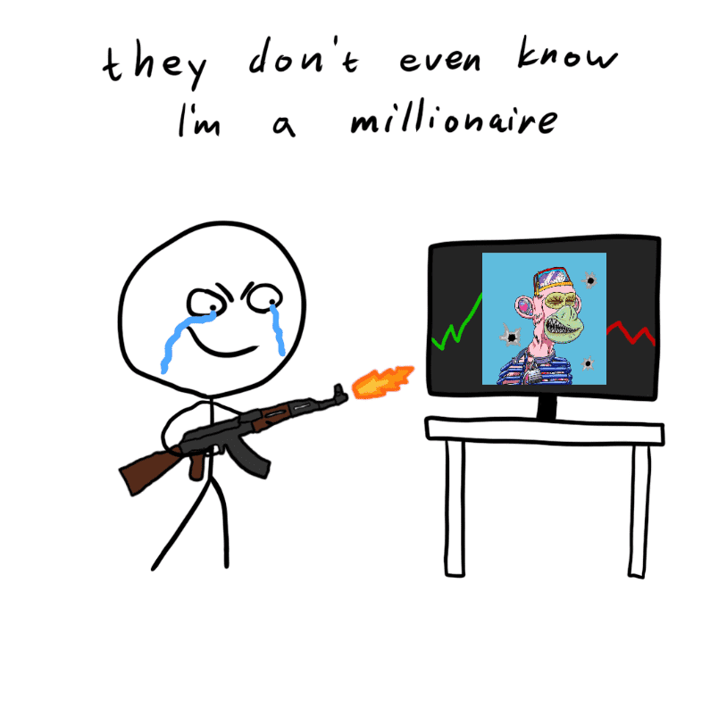

# Don't Mint This Shit

Don't Mint This Shit NFT 在过去 7 天内售出 1 次。Don't Mint This Shit 的总销售额为 0 美元。Don't Mint This Shit NFT 的平均价格为 0 美元。有 709 位 Don't Mint This Shit 所有者，总共拥有 6,969 个代币。

免费薄荷糖要卖了 BRRRRRR 去他妈的这个，不要铸造这个。很可能是地毯，对吧？正确的？OOOR 是 10 ETH 编程的吗？

不要铸造这个狗屎 NFT - 常见问题（FAQ）
▶ 什么是不要造币厂？
不要铸币这个狗屎是一个 NFT（不可替代令牌）集合。存储在区块链上的数字艺术品集合。
▶ 有多少 Don't Mint This Shit 代币存在？
总共有 6,969 个 Don't Mint This Shit NFT。目前，709 位所有者的钱包中至少有一个 Don't Mint This Shit NTF。
▶ Don't Mint This Shit 销售中最贵的是什么？
出售的最昂贵的 Don't Mint This Shit NFT 是 #1267。它于 2022-06-11（3 个月前）以 4.4 美元的价格售出。
▶ 最近卖了多少 Don't Mint This Shit？
过去 30 天内售出了 3 个 Don't Mint This Shit NFT。

