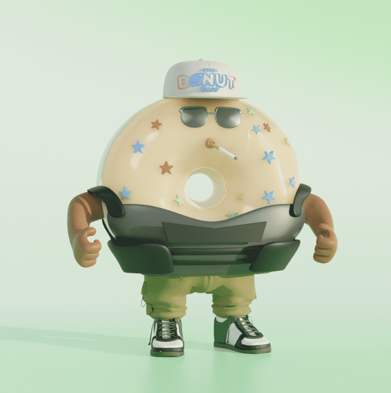

# DonutShop

甜甜圈店团队
甜甜圈店是 5,432 个 3D 甜甜圈的集合——每个甜甜圈都以一丝不苟的细节和 1 个独特的特征之一制作而成。 Donut Shop 拥有如此多稀有和独特的特征，是一个在市场上无与伦比的 NFT 系列。 作为顶部的点缀，该系列旨在以物理甜甜圈体验的形式带来现实生活中的实用程序。 持有者还将获得特殊活动、赠品等的独家访问权。 以前所未有的方式体验 NFT，享受令人愉悦的甜点。 🍩

🍩甜甜圈 = 好处
所有预售薄荷糖终生免费甜甜圈，常客供应一年。每个薄荷糖都可以在可用时从 donut dao 接收空投。必须持有并退市
✨元节每个薄荷糖都可以访问 3d 字符文件，以在元节中使用您的甜甜圈。
元节实用程序
你是生意
💰赌上你的甜甜圈
每个铸币厂都带有 DONUT DAO 的好处，这意味着每个持有人都可以直接从 DONUT DAO 索取空投。持有人还将在企业内对重要的添加或删除具有决策能力。

