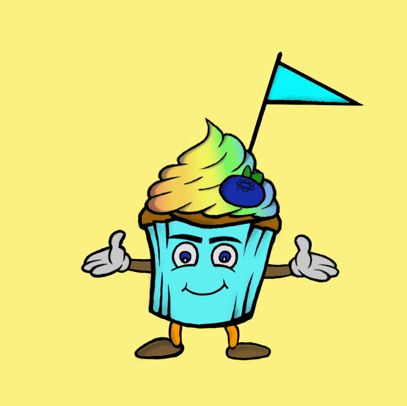

# Doodle Cupcake Club

过去 7 天内没有售出 Doodle Cupcake Club。

Doodle Cupcake Club 是独一无二的 handmate NFT 系列。
价格：第 1 阶段：1-50 0.002-0.003 ETH第 2 阶段：51-100 0.003-0.004 ETH第 3 阶段：101-150 0.004-0.005 ETH

涂鸦纸杯蛋糕俱乐部 NFT - 常见问题 (FAQ)
▶ 什么是涂鸦纸杯蛋糕俱乐部？
Doodle Cupcake Club 是一个 NFT（非同质代币）系列。存储在区块链上的数字艺术品集合。
▶ 有多少 Doodle Cupcake Club 代币？
总共有 36 个 Doodle Cupcake Club NFT。目前，16 位所有者的钱包中至少有一个 Doodle Cupcake Club NTF。
▶ 最近卖出了多少 Doodle Cupcake Club？
过去 30 天内售出 0 个 Doodle Cupcake Club NFT。
▶ 什么是流行的 Doodle Cupcake Club 替代品？
许多拥有 Doodle Cupcake Club NFT 的用户还拥有 Crypto Family Girls、 Animal Coffee、 我的名字叫 poppy和 SavageSouls。

