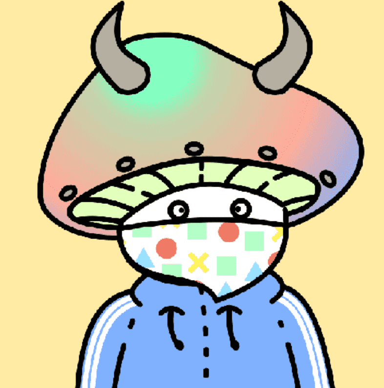

# Doodle Mushroom

过去 7 天没有出售 Doodle Mushroom。

3000 First Mint 免费 在那之后薄荷：0.0015（仅限）薄荷在这里

Doodle Mushroom 是 4000 个可生成的 pfp NFT 的集合。由 245 多种可能性特征生成。受最伟大项目涂鸦启发的艺术风格。

收入的 20% 将捐赠给慈善机构。10% 的收入将给予拥有最多涂鸦蘑菇的持有者：

拥有最多蘑菇：第一次获得 5% 的收入第二次获得 3% 的收入第三次获得 2% 的收入

涂鸦蘑菇 NFT - 常见问题 (FAQ)
▶ 什么是涂鸦蘑菇？
Doodle Mushroom 是一个 NFT（非同质代币）集合。存储在区块链上的数字艺术品集合。
▶ 有多少 Doodle Mushroom 代币？
总共有 3,210 个 Doodle Mushroom NFT。目前，396 位所有者的钱包中至少有一个 Doodle Mushroom NTF。
▶ 最近卖了多少个Doodle Mushroom？
过去 30 天内售出 0 个 Doodle Mushroom NFT。
▶ 流行的涂鸦蘑菇替代品有哪些？
许多拥有 Doodle Mushroom NFT 的用户还拥有 SPACE SMASHERS、 Lil Monkies、 Fresh Frogs NFT (FROG)和 The Not Azuki Garden。

