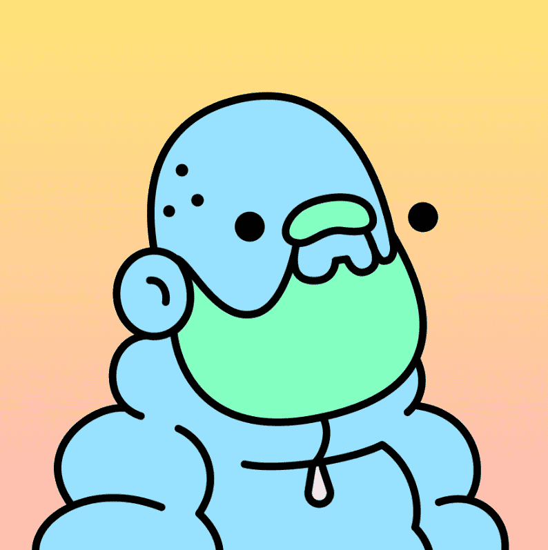

# Doodles

一个社区驱动的收藏品项目，以 Burnt Toast 的艺术为特色。 涂鸦有多种颜色、特征和大小，收藏数量为 10,000。 每个 Doodle 都允许其所有者为由 Doodles 社区财政部支付的体验和激活投票。

Space Doodles 是您进入银河系的第一次冒险，以发现快乐和彩虹呕吐。这是向收藏家展示我们的宇宙的第一步，它拥有由 Burnt Toast 设计的数十艘宇宙飞船。

你的涂鸦在寻找什么？它要去哪里？你附近还有多少其他涂鸦者？在我们揭示宇宙的第一步中，您的涂鸦是回答这些问题的关键。

所有涂鸦者都可以免费领取他们的太空涂鸦，并在他们的个人宇宙飞船中获得自己独特的外观和能力。“膀胱管理”和“驾驶能力”等统计数据定义了 Doodles 在太空中的能力。

涂鸦是由 Burnt Toast 设计的数百个令人兴奋的视觉特征组成的 10,000 个 NFT（不可替代代币）的集合。手绘涂鸦包括骷髅、猫、外星人、猿和吉祥物。Doodles 系列还包括数十种罕见的头像、服装和艺术家调色板的配色。

Doodles 世界不断扩大，Space Doodles 等新体验仅对收藏家开放。随着宇宙的扩大，我们的品牌也在不断发展，收藏家可以通过所有权获得最新产品、商品和活动的独家访问权。

拥有 Doodle 可以让您对社区驱动的功能、产品和活动进行投票。这使得我们的路线图协作由项目创始人和 Doodle 持有者通过 Doodlebank 决定。Doodlebank 是我们的社区金库，拥有超过 500 万美元，用于资助这些体验。

