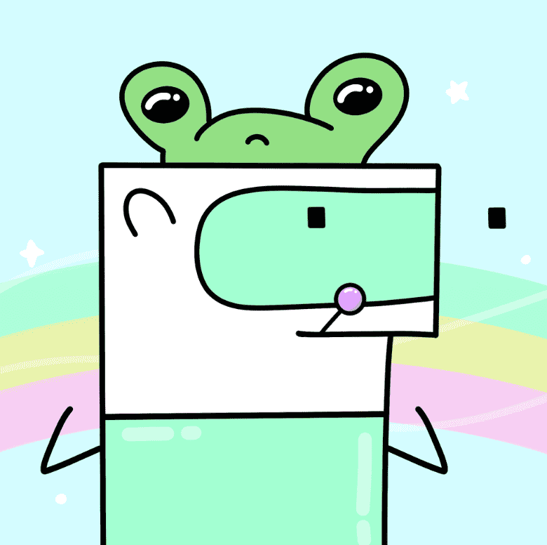

# Doodlesaurs World

Doodlesaurs 是生活在以太坊主网上的可爱生物。 该集合由 7.777 个随机生成的涂鸦恐龙组成。 我们的主要想法是创建一个社区，由爱好者、投资者和热爱 NFT 的人组成！

常问问题

什么是涂鸦龙？

Doodlesaurs 是生活在以太坊主网上的可爱生物。
该集合由 7.777 个随机生成的涂鸦恐龙组成。
我们的主要想法是创建一个社区，由
爱好者、投资者和热爱 NFT 的人组成。

总供应量是多少？

将生成 7,777 个 doodlesaurs。

我在哪里可以造币？

薄荷在我们的网站上。你现在就在这里。

我怎样才能铸造doodlesaurs？

在网站上连接您的 Metamask 帐户，并支付费用。
你需要一个 Metamask 钱包和一些 ETH。

铸币价格是多少？

一枚薄荷是免费的 + 汽油价格。一个以上的成本为 0.02 eth。最多：每笔交易 20 分钟。

