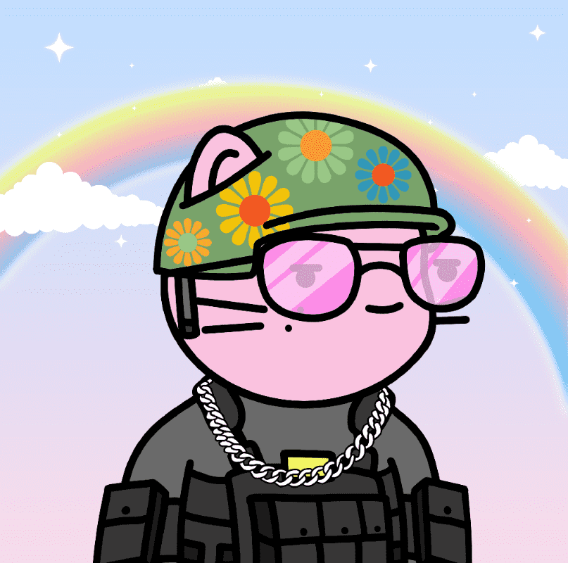

# Doodles Cats NFT

Doodles Cats 是存在于以太坊区块链上的 1205 个随机生成和手绘的 NFT 集合。 Doodles Cats 持有者可以参加独家活动，在元宇宙中找到它们！ 请记住，所有 Doodles Cats 都很酷，但有些比其他猫更酷。

猫探索涂鸦猫社区！

涂鸦和酷猫社区令人难以置信的融合！

4,949 只涂鸦猫现在隐藏在 Metaverse 中，随时可以被发现！‍在底价涨之前

DAO 和质押
怀着与其他蓝筹 NFT 社区一样有影响力的雄心壮志，我们将在预铸币中投入超过 80 万美元的营销预算。

玩赚
我们将开发一款像 Axie Infinity 这样的游戏，让您可以通过猫来赚钱。此外，我们将提供奖学金解决方案，通过被动收入赚钱，让每个人都可以玩。

奖学金
奖学金是经理将他们的免费涂鸦猫（数字宠物）借给“学者”的过程，他们是游戏的初学者，没有足够的资金来组建一个由 NFT 小猫组成的团队来玩游戏。

元界投资
我们的 NFT 收藏旨在建立一个强大且有影响力的社区，因此我们将采取一系列行动，通过元宇宙传播 Doodles Cats。

在 Metaverse 中获得土地

创建 MeowLand：Doodles Cats 总部

MeowLand 的 Cat'Gallery

Cat'Chella：组织猫音乐节

活动：组织休闲活动（互动游戏、电影、展览、网络活动……）

NFT大楼会议NFT Building 会议的组织：开发图、影响力营销、NFT 策略

合伙与 Metaverse 和 NFT 宇宙中的宠物项目建立独家合作伙伴关系，由于这些付费合作伙伴关系，70% 的版税将捐给动物收容所组织。

推销对我们精彩的社区充满热情，我们将提出独特的衍生物品系列，以自豪地展示我们社区在世界各地的色彩。

$牛奶我们的一部分资金将用于项目的开发，并将在我们的路线图 2.0 中体现

路线图 2.0 带来了许多其他惊喜！
营销计划
我们的目标是确保 Doodles Cats 社区长期保持强大和团结

庞大的营销预算
怀着与其他蓝筹 NFT 社区一样有影响力的雄心壮志，我们将在预铸币中投入超过 80 万美元的营销预算。

