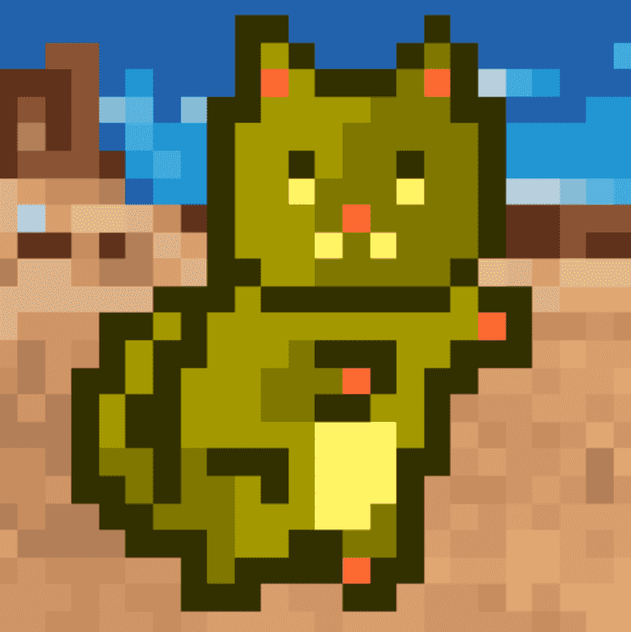

# DoomCatRescue

过去 7 天没有售出 DoomCatRescue。25,600 只猫的集合，现已提升到新的水平。

销售有困难？确保您已批准您的猫在这里交易：https://www.doom.cat/#/open-sea-approval

DoomCatRescue NFT - 常见问题（FAQ）
▶ 什么是 DoomCatRescue？
DoomCatRescue 是一个 NFT（不可替代令牌）集合。存储在区块链上的数字艺术品集合。
▶ 存在多少 DoomCatRescue 代币？
总共有 5,170 个 DoomCatRescue NFT。目前，1,247 名所有者的钱包中至少有一个 DoomCatRescue NTF。
▶ 最昂贵的 DoomCatRescue 销售是什么？
出售的最昂贵的 DoomCatRescue NFT 是 DoomCat #1441。它于 2022-08-21（12 天前）以 14.1 美元的价格售出。
▶ 最近卖出了多少 DoomCatRescue？
过去 30 天内售出了 4 个 DoomCatRescue NFT。

