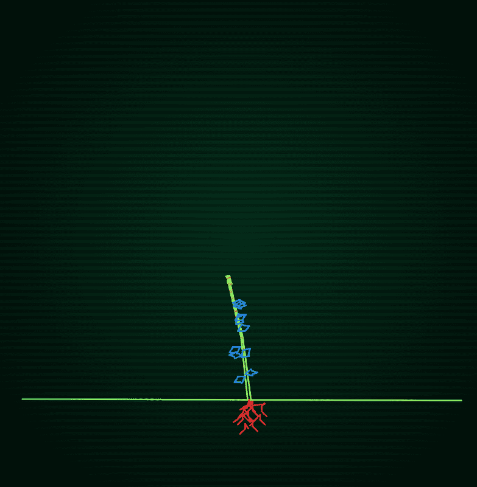

# Doomsday Garden

Doomsday Garden 是一个新的动态 NFT 项目，必须在其中挖掘代币，并增长和积累 ETH。 每一个世界末日花园 NFT 都是独一无二的 1/1 树，随着种植更多的树而生长。 随着树木的生长，它们会积累 ETH，这些 ETH 可以被 NFT 的所有者收获。

花园，这是[世界末日 NFT])世界中的一个新的动态 NFT 项目，NFT 必须在其中开采，并在其中增长和积累 ETH。每一个世界末日花园 NFT 都是一棵独特的树，随着种植更多的树而生长。随着树木的生长，它们会积累 ETH，NFT 的所有者可以收获这些 ETH。

可开采

世界末日花园是以太坊区块链上的不可替代代币。树只能通过挖矿获得，与创建比特币和以太币的过程相同。

连接钱包开始挖矿。树木生长

末日之树不是静止的，它们从萌芽开始，慢慢生长。每棵树都是独一无二的，具有从令牌的哈希派生的分支和叶子模式。生长速度取决于种植其他树木的速度。

