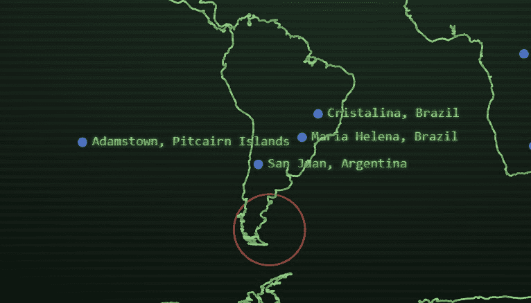

# Doomsday NFT

世界末日 NFT 统计
创建于 8 个月前，1 代币供应，5% 费用
过去 7 天没有出售 Doomsday NFT。

Doomsday NFT 是一款全新的链上生存游戏。NFT 是隐藏在世界末日边缘的城市下方的掩体。随着游戏的开始，太空碎片将冲向地球，消灭幸存者，直到留下一个单独的掩体。

世界末日 NFT NFT - 常见问题（FAQ）
▶ 什么是世界末日 NFT？
Doomsday NFT 是一个 NFT (Non-fungible token) 集合。存储在区块链上的数字艺术品集合。
▶ 世界末日 NFT 代币有多少？
总共有 1 个 Doomsday NFT NFT。目前 1 位所有者的钱包中至少有一个 Doomsday NFT NTF。
▶ 最近卖出了多少 Doomsday NFT？
过去 30 天内售出 0 个 Doomsday NFT NFT。

