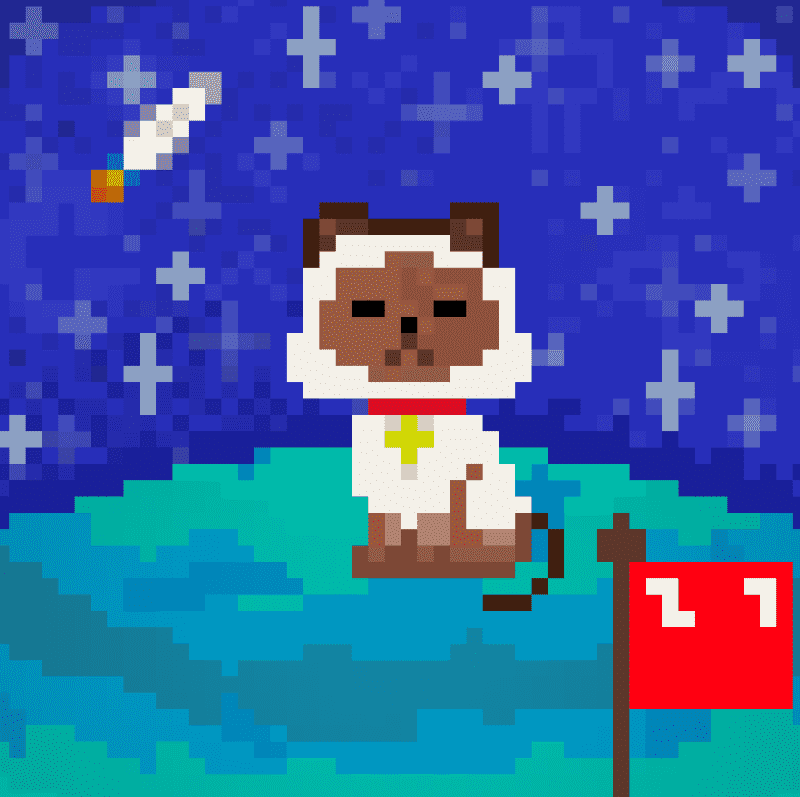

# DoonX Cats

Mint IS Alive：https://doonxcats.xyz/ 你想住在元宇宙星球 DoonX 上吗？ DoonX 猫是生活在 DoonX 星球上的 5,666 只可爱的猫。 这种生活在以太坊区块链上的独特数字收藏品也是进入元界星球 DoonX 的通行证。

MoonCats NFT 在过去 7 天内售出 60 次。MoonCats 的总销售额为 4.77 万美元。MoonCats NFT 的平均价格为 795 美元。有 5,839 名 MoonCats 所有者，总共拥有 19,197 个代币。

2017 年 8 月 10 日启动的 MoonCatRescue 疯狂可爱行动取得了成功！获救的 25440 只 MoonCats 正在适应它们作为完全链上可收藏小动物的生活。

复古、生成、公平分配的先驱，MoonCats 也可以在链上MoonCatBoutique进行定制！

所有者拥有其 MoonCat 图像的个人和商业许可。

