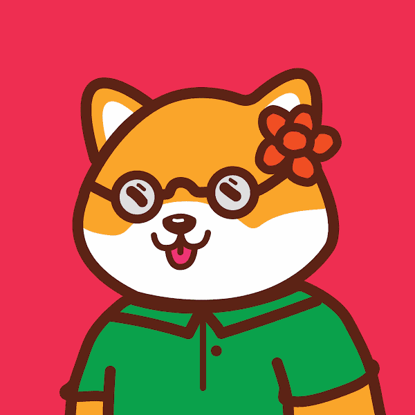

# Dope Shibas

Dope Shibas是以太坊主网上的一个很酷的退化集合，也是对Cool Cats的致敬。该系列由10，000个随机生成的Shiba组成，这些Shibas由180个不同的项目组装而成。
Dope Shibas NFT - 常见问题（FAQ）
▶ 什么是原液芝？
Dope Shibas是NFT（不可替代令牌）集合。存储在区块链上的数字艺术品的集合。
▶ 有多少个Dope Shibas代币存在？
总共有9，899个Dope Shibas NFT.目前有4，056个所有者在他们的钱包中至少有一个Dope Shibas NTF。
▶ 最昂贵的Dope Shibas销售是什么？
出售的最昂贵的Dope Shibas NFT是Dope Shiba #5849。它在2022-08-18（8天前）以$ 28.1的价格出售。
▶ 最近卖了多少个Dope Shibas？
在过去的30天内，有26个Dope Shibas NFT售出。
▶ 一个芝麻的药耗多少钱？
在过去的30天里，最便宜的Dope Shibas NFT销售额低于10美元，最高销售额超过23美元。过去30天内，Dope Shibas NFT的中位数价格为14美元。
▶ 什么是流行的Dope Shibas替代品？
许多拥有Dope Shibas NFT的用户还拥有Shiba Social Club Official Collection，GenZ（ebra），Pork1984|创世纪和贫民窟的亿万富翁。

