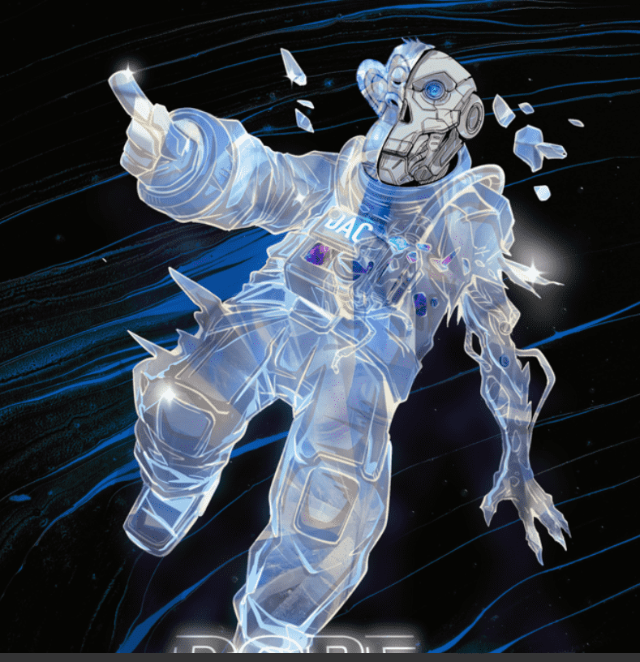

# DopeApeClub

@sigroll 支持的第一个基于 BAYC 持有者（#4555、#4372、#2420、#8648、#1769、#6582、#4695）授权的知识产权的 NFT 集合。 只是生活在平行宇宙中的涂料猿，穿着涂料服装。

什么是 DOPE APE 俱乐部 (DAC)

Dope Ape Club 是第一个基于授权 BoredAPE IP 的衍生项目。免费薄荷。涂料艺术，社区和氛围。

在 Sigroll 的支持下，我们获得了 7 只 OG Bored 猿的许可协议，我们用它们在我们自己的愿景中播种了全新的猿系列。

扩展大猿家族
我们将 DOPE APE 俱乐部视为猿类大家族的延伸。直接从我们的 7 个猿类祖先中诞生。
对我们来说，这是一个关于艺术、社区和讲故事的思想实验。当 BAYC 赋予其社区商业权利时，它赋予了社区扩展其宇宙的权利。这就是我们想要对这个系列做的事情。

如果我们不创造另一种类人猿的仿制衍生物，而是手工挑选一些我们最喜欢的类人猿，许可他们的类人猿并扩大他们的血统，那会怎么样。有趣的思考食物。

现在，如果我们社区中的某个人随后许可了我们的一些猿类并将其扩展，该怎么办？能走多远？什么样的新艺术作品、IP和故事可以从中产生？

我们想开始谈话。让创作者和收藏家讨论和思考 NFT 许可、NFT 谱系和收藏扩展方式。

