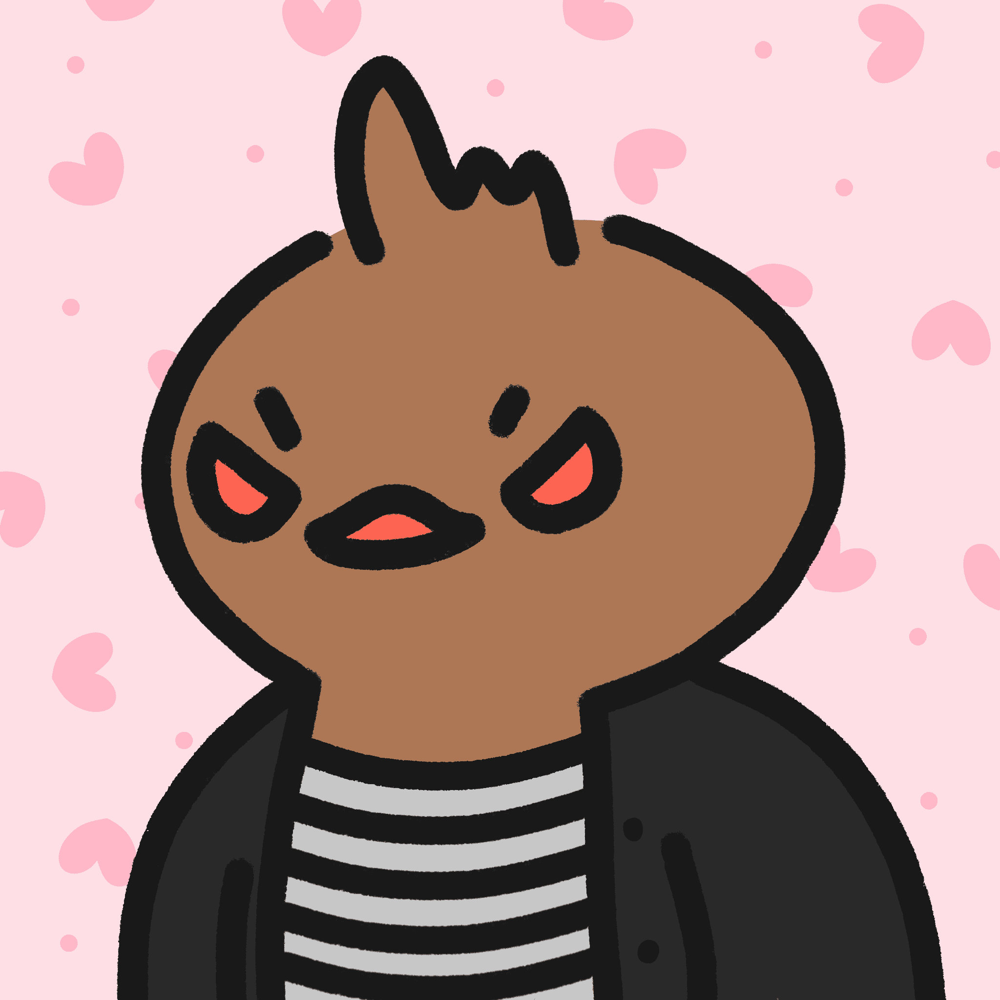

# Dopey Ducklings

最可爱的，算法生成的鸭子NFT的集合。每只鸭子都是完全独特的，是从数百万种组合中挑选出来的。只有2000只鸭子会存在。
笨拙的小鸭 NFT - 常见问题（FAQ）
▶ 什么是傻小鸭？
Dopey Ducklings是NFT（不可替代令牌）集合。存储在区块链上的数字艺术品的集合。
▶ 有多少只小鸭子令牌存在？
总共有2，044只Dopey Ducklings NFT.目前有858个所有者在他们的钱包里至少有一个Dopey Ducklings NTF。
▶ Dopey Ducklings最昂贵的销售是什么？
最昂贵的Dopey Ducklings NFT售出的是#1203。它在2022-08-17（8天前）以$ 6.9的价格出售。
▶ 最近卖了多少只傻小鸭？
在过去的30天内售出了1只Dopey Ducklings NFT。

