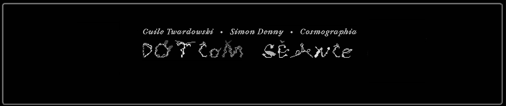

# DotCom Seance

在网络泡沫中重振幽灵的链上 通灵术

DotCom Seance NFT - 常见问题（FAQ）
▶ 什么是 DotCom 降神会？
DotCom Seance 是一个 NFT（不可替代令牌）集合。存储在区块链上的数字艺术品集合。
▶ 存在多少个 DotCom Seance 代币？
总共有 403 个 DotCom Seance NFT。目前，204 位所有者的钱包中至少有一个 DotCom Seance NTF。
▶ 最昂贵的 DotCom 降神会销售是什么？
售出的最昂贵的 DotCom Seance NFT 是 由 Cosmographia 与 Simon Denny 和 Guile Twardowski 重新构想的 Financialprinter.com (1999-2001)。它于 2022-06-20（2 个月前）以 109.8 美元的价格售出。
▶ 最近卖出了多少 DotCom Seance？
过去 30 天内售出了 3 个 DotCom Seance NFT。

