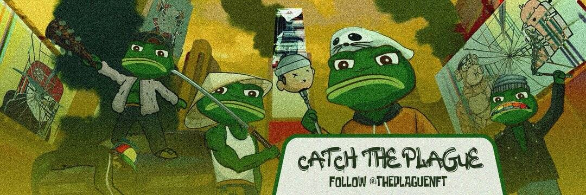

# DownbadDAO

恭喜！ 如果您在 twitter DM <3 Ribbit 🐸 上将您的 discord ID 发送给我，而不是票，会更容易

downbaddao NFT - 常见问题（FAQ）
▶ 什么是下巴道？
downbaddao 是一个 NFT (Non-fungible token) 集合。存储在区块链上的数字艺术品集合。
▶ 有多少个downbaddao 代币？
总共有 downbaddao NFT。目前有 0 个所有者在他们的钱包中至少有一个 downbaddao NTF。
▶ 最昂贵的下巴道销售是什么？
最昂贵的 downbaddao NFT 是 DownBad Dao #72。它于 2022 年 6 月 23 日（2 个月前）以 6.6 美元的价格售出。
▶ 最近卖了多少downbaddao？
过去 30 天内卖出了 3 个 downbaddao NFT。
▶ 什么是流行的下巴道替代品？
许多拥有 downbaddao NFT 的用户还拥有 Touch Pixel Grass、 METASQUATCH 的 FOREST、 EL NUMEROS和 DegenOkayBears。

