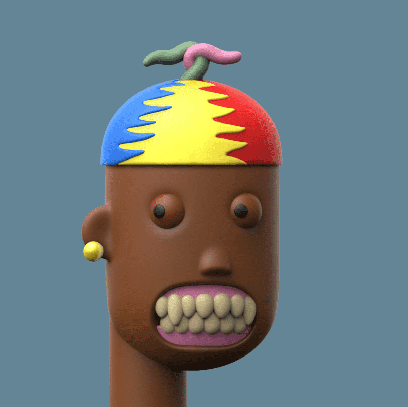

# Dr. ETHvil's 3D FrankenPunks

我们是一个以社区为基础的收藏品项目，以 3D Punks 的艺术为特色。 3D FrankenPunks 有各种形状、特征和大小，沿途还有一些惊喜。 集合大小为 10,000。 每个 FrankenPunk 都允许其所有者对创造体验和影响项目开发进行投票，这些费用由 Punksville 社区财政部支付。

博士。ETHVIL 是您前往弗兰肯朋克实验室的向导
3D FrankenPunks 是由“Dr. Ethvil”占据了不受欢迎的朋克地板并决定创建一个实验性的 NFT 游戏。
进入实验室
什么是 3D 科学朋克？
为了生存，这些朋克怪物需要由一群善良的 FrankenPunks 照顾，如果照顾得当，Ethvil 博士将让他们控制 CryptoPunks 怪物。加入我们，参与迄今为止 NFT 历史上风险最高的游戏……
加入朋克维尔10,000 名独特的弗兰肯朋克
您可以收到 100,000 种组合。每个都有不同的身份。

