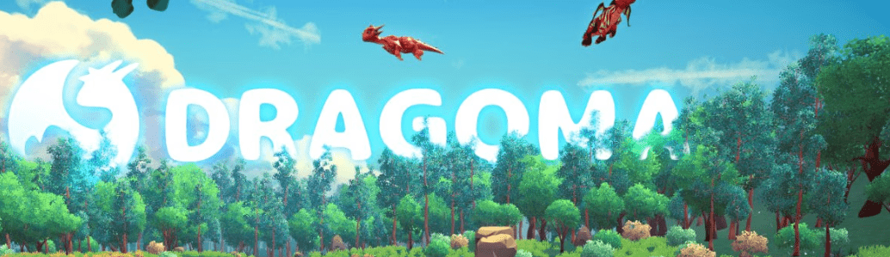

# Dragoma

Dragoma 将打造世界上最大的 Web3 项目

Dragoma是包含 4 个特征和 77 个属性的生成艺术。我们的智能合约部署在 Polygon 网络上，因此您可以节省燃气费。在您决定购买 DAC 之前，请仔细阅读 DAC 智能合约。

Dragoma NFT - 常见问题（FAQ）
▶ 什么是 Dragoma？
Dragoma是一个 NFT（非同质代币）集合。存储在区块链上的数字艺术品集合。
▶ 有多少Dragoma代币？
总共有 2,305 个 Dragoma NFT。目前，732 位所有者的钱包中至少有一个DragomaNTF。
▶ 最近卖出了多少 Dragoma？
过去 30 天内售出 0 个 DragomaNFT。

