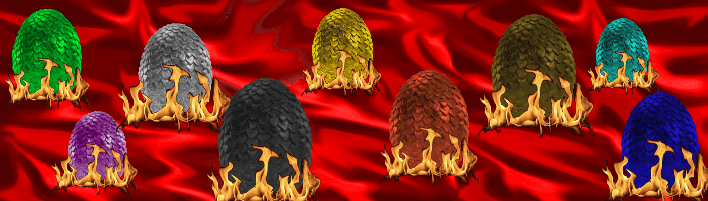

# Dragon Eggs on Polygon

Metaverse Dragon Eggs 项目共有 10,000 个鸡蛋，这些鸡蛋是在多边形区块链上创建的。 收养你的鸡蛋，看着它们在未来升值。 这是一个收藏品，每个人都是罕见的。 玩得开心！

Polygon NFT 上的 Galaxy Dragon Club Eggs - 常见问题（FAQ）
▶ 什么是多边形上的银河龙俱乐部彩蛋？
Polygon 上的 Galaxy Dragon Club Eggs 是一个 NFT（非同质代币）集合。存储在区块链上的数字艺术品集合。
▶ Polygon 代币上有多少银河龙俱乐部彩蛋？
Polygon NFT 上总共有 10,000 个 Galaxy Dragon Club Eggs。目前，13 位所有者的钱包中至少有一个 Polygon NTF 上的 Galaxy Dragon Club Eggs。
▶ Polygon 上的银河龙俱乐部蛋最近卖出了多少？
在过去 30 天内售出的 Polygon NFT 上有 0 个 Galaxy Dragon Club Eggs。
 交互式 NFT 项目：Goofball Gang。

