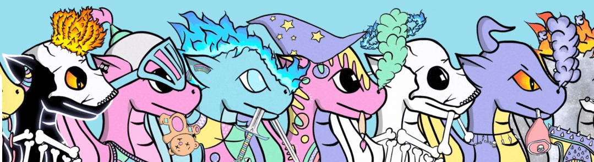

# Dragon Fam Genesis

Dragon Fam 是以太坊区块链上 2000 条彩色、手绘和坏蛋龙的集合。 该团队在 web2 中运营业务方面经验丰富，并且完全被 doxxed。 Dragon Fam 持有者仅仅因为持有而不列出他们的龙而获得龙币。 我们将成为儿童产品的品牌，如故事书、着色书、服装等。 今天真正的实用程序和具有 30 年愿景的真正路线图。

Dragon Fam Genesis NFT 在过去 7 天内共售出 16 次。Dragon Fam Genesis的总销售额为563.39美元。一份 Dragon Fam Genesis NFT 的平均价格为 35.2 美元。龙族创世拥有者256人，总供应量2000枚。

