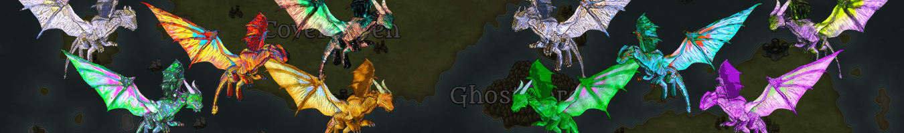

# Dragon Hunters

龙 0-19 保留用于赠品和其他惊喜。 它们不可购买。 从 20+ 中选择龙。我们是一款在 Polygon 上使用卡片的社交游戏，用户可以在其中与我们一起书写 Athrum 的故事！ 给自己一条龙，从 4 个家族中选择一个，开始统治 Athrum 的战斗！ 🐲🔥未来，将发布新的收藏以扩展 Athrum 的传说，包括新的角色、武器和生物。 它们将是 1,000 条龙的力量的修正/倍增。 1,000 条龙将是唯一被释放的龙。网站 Twitter Discord 白皮书/如何玩

Dragon Hunters NFT - 常见问题（FAQ）
▶ 什么是猎龙者？
Dragon Hunters 是一个 NFT（Non-fungible token）集合。存储在区块链上的数字艺术品集合。
▶ 猎龙者代币有多少？
总共有 1,000 个 Dragon Hunters NFT。目前 101 位所有者的钱包中至少有一个 Dragon Hunters NTF。
▶ 最近卖了多少猎龙者？
过去 30 天内共售出 0 个 Dragon Hunters NFT。

