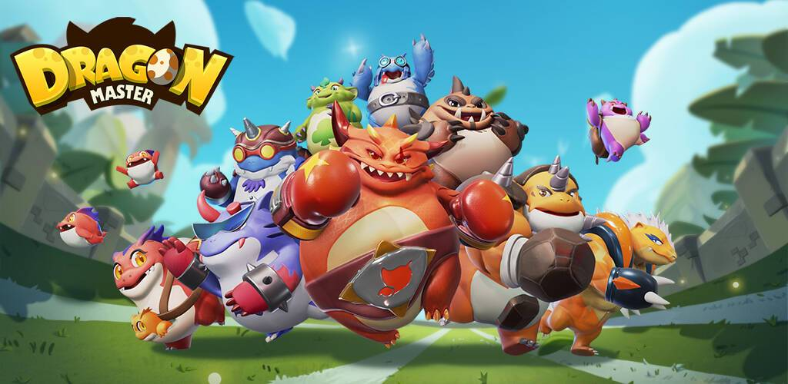

# Dragon Master Box

DragonMaster 是第一款基于区块链的元界游戏，融合了 RTS、MOBA、Collection 和 Play-to-Earn 游戏玩法。 未来将引入土地系统，让玩家可以自由发展自己的家乡，通过适当的部署防御对手，通过战斗和资源掠夺来增强自己，以及进行群体交战。

Dragon Master Box NFT 在过去 7 天内共售出 2 次。Dragon Master Box 的总销售额为 72.45 美元。一个 Dragon Master Box NFT 的平均价格为 36.2 美元。Dragon Master Box 拥有者 489 人，总供应量 2,190 个。

Dragon Master Box NFT - 常见问题（FAQ）
▶ 什么是龙师宝箱？
Dragon Master Box 是一个 NFT (Non-fungible token) 集合。存储在区块链上的数字艺术品集合。
▶ Dragon Master Box 代币有多少？
总共有 2,190 个 Dragon Master Box NFT。目前 489 位拥有者的钱包中至少有一个 Dragon Master Box NTF。
▶ 什么是最昂贵的龙大师盒子销售？
最贵的 Dragon Master Box NFT 是 FOUR-EGG Box #2431。它于 2022-06-08（3 个月前）以 227.1 美元的价格售出。
▶ 最近卖了多少龙师宝盒？
过去 30 天内共售出 36 个 Dragon Master Box NFT。
▶ 龙师宝箱要多少钱？
过去 30 天，最便宜的 Dragon Master Box NFT 销售额低于 48 美元，最高销售额超过 222 美元。过去 30 天，Dragon Master Box NFT 的中位价格为 63 美元。

