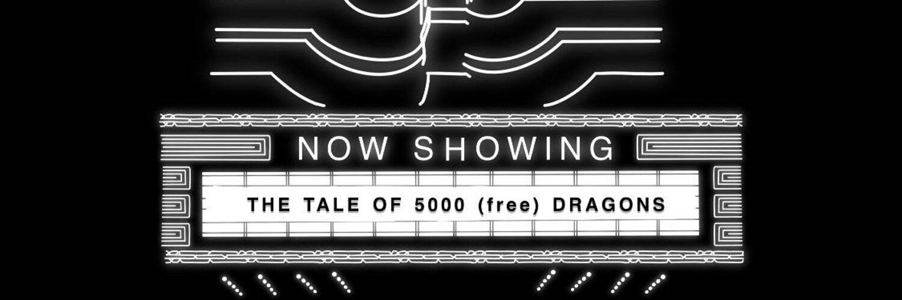

# DragoniaNFT

DragoniaNFT NFT - 常见问题（FAQ）
▶ 什么是 DragoniaNFT？
DragoniaNFT 是一个 NFT（Non-fungible token）集合。存储在区块链上的数字艺术品集合。
▶ 有多少 DragoniaNFT 代币？
DragoniaNFT NFT 总共有 5,000 个。目前，1,585 位所有者的钱包中至少有一个 DragoniaNFT NTF。
▶ DragoniaNFT 最昂贵的交易是什么？
最昂贵的 DragoniaNFT NFT 是 Dragonia #409。它于 2022 年 6 月 12 日（2 个月前）以 7.3 美元的价格售出。
▶ 最近卖出了多少 DragoniaNFT？
过去 30 天内共售出 7 个 DragoniaNFT NFT。
▶ 什么是流行的 DragoniaNFT 替代品？
许多拥有 DragoniaNFT NFT 的用户还拥有 MetaSpaceBabies、 Knot Okay Bears NFT、 aholes official和 hobittown.wtf。

