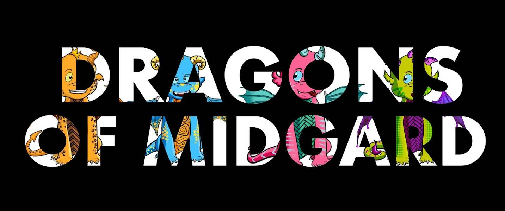

# Dragons Of Midgard Official Collection

10,000 个独特的 Dragons NFT 在以太坊区块链上生活、发展和战斗。 Dragons of Midgard 准备通过独特的 Play-To-Earn 游戏永远颠覆 NFT 市场。

Dragons Of Midgard 官方合集 NFT - 常见问题（FAQ）
▶ 什么是 Dragons Of Midgard 官方收藏？
Dragons Of Midgard 官方合集是一个 NFT（非同质代币）合集。存储在区块链上的数字艺术品集合。
▶ 有多少 Dragons Of Midgard 官方收藏代币？
总共有 782 条 Dragons Of Midgard 官方合集 NFT。目前，336 位车主的钱包中至少有一本 Dragons Of Midgard Official Collection NTF。
▶ 最近卖出了多少《中庭之龙》官方合集？
过去 30 天共售出 0 个 Dragons Of Midgard Official Collection NFT。

