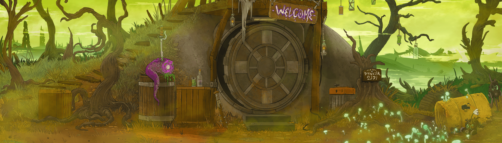

# DraGONS 2171

生活在Bunker 2171 东北方的雄伟飞行生物。DraGONS 系列的每个元素都可以在 2171 天内每天获得 1 美元琥珀。 $AMBER 是 Bunker2171 生态系统的实用代币。 这不是投资，也没有经济价值。 $AMBER 代币是用户可以激活 Alien Kimera 协议并可以在我们的生态系统内购买数字/实物物品的一种方式。 Bunker2171 是一个社区驱动的项目。Bunker 2171MutantKongz 的 6 个集合中的第 5 个 https://opensea.io/collection/mutantkongz
大猩猩复仇女神 https://opensea.io/collection/gorillanemesis
地堡编年史 https://opensea.io/collection/bunkerchronicles
地堡野兽 https://opensea.io/collection/bunkerbeasts
巨龙 https://opensea.io/collection/dragons2171
Alienkimera 协议 https://opensea.io/collection/alienkimeraprotocol

在过去的 7 天内，DraGONS 2171 个 NFT 被售出 17 次。Dragons 2171 的总销售额为 260.18 美元。一枚 Dragons 2171 NFT 的平均价格为 15.3 美元。共有 730 名 Dragons 2171 拥有者，拥有总供应量 3,757 个代币。

