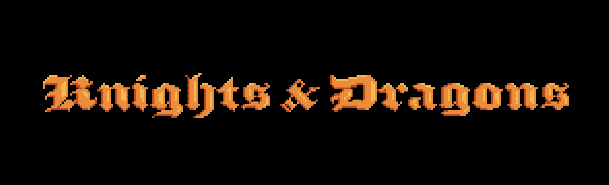

# Dragons Game

Opensea 上的持有者数量并不准确，因为许多 NFT 被质押以赚取 $GOLD。在 Dragon Game 中，龙和骑士争夺诱人的 $GOLD 奖品。 该游戏为 NFT 所有者提供实用程序，并在以太坊链上运行。$GOLD 是 Knights & Dragons 的实用程序令牌，仅用于游戏。 除了用于玩《骑士与龙》之外，开发团队不会出售或提供此代币的价值。

Dragons Game NFT - 常见问题（FAQ）
▶ 什么是龙之游戏？
Dragons Game 是一个 NFT（非同质代币）集合。存储在区块链上的数字艺术品集合。
▶ Dragons Game代币有多少？
总共有 10,000 个 Dragons Games NFT。目前，423 位所有者的钱包中至少有一个 Game Of Dragons NTF。
▶ 最近卖了多少龙之战？
过去 30 天内共售出 0 个 Dragons GameNFT。

