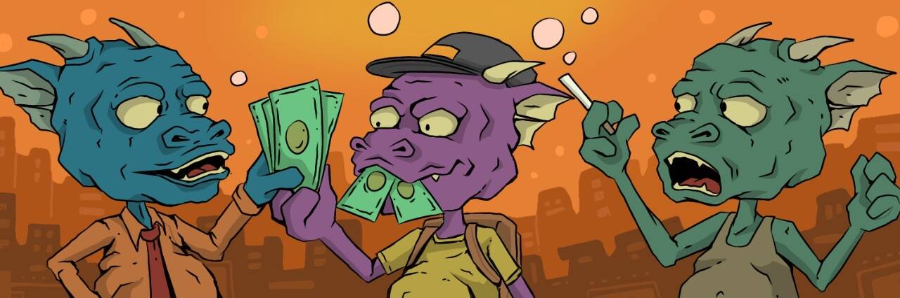

# dragon-town.wtf

Dragon-town.wtf NFT 在过去 7 天内售出 3 次。Dragon-town.wtf 的总销售额为 $0.64。一个 dragon-town.wtf NFT 的平均价格为 0.2 美元。Dragon-town.wtf 拥有者 2,079 人，总供应量为 10,000 个。

dragontownwtf NFT - 常见问题（FAQ）
▶ 什么是dragontownwtf？
Dragontownwtf 是一个 NFT（非同质代币）集合。存储在区块链上的数字艺术品集合。
▶ 有多少个 dragontownwtf 代币？
总共有 1,408 个 dragontownwtf NFT。目前 762 位车主的钱包中至少有一个 dragontownwtf NTF。
▶ 最贵的dragontownwtf 销售是什么？
最昂贵的 dragontownwtf NFT 是 Dragon Town #659。它于 2022-06-10（3 个月前）以 10.4 美元的价格售出。
▶ 最近卖了多少个dragontownwtf？
过去 30 天内售出 1 个 dragontownwtf NFT。

